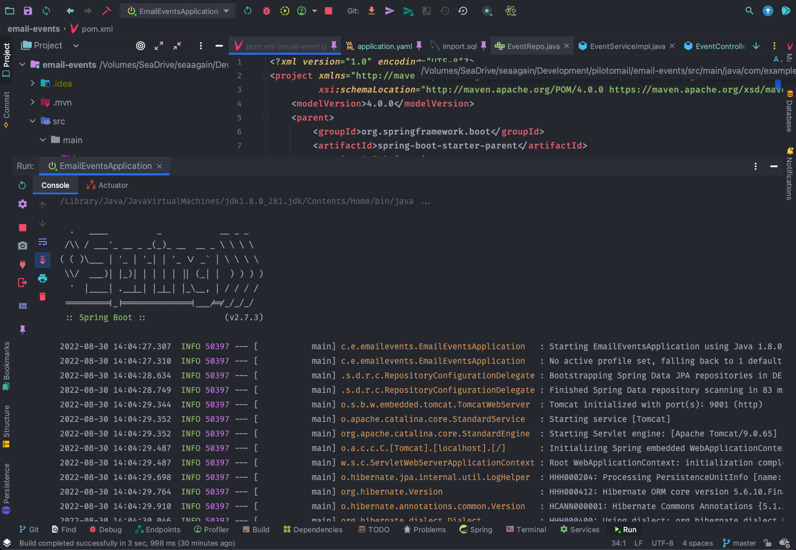

# README

- Table of Contents

# About

This web server can serve 2 types of email events, **open** and **click**. The server contains 3 routes: 

1. `POST /events`: this route will handle posting events
2. `GET /events`: this route will serve events back to a client as a whole or filtered by **action**, **recipient**, or **timestamp** query parameters. 
3. `GET /summary`: this route will serve event count for each action (open, click) filtered by **recipient** or a **startDate/endDate** combination. 

## Data

The structure of email events will be the following:

```
// Event
{
  id: UUID,
  action: String, // => Should be limited to `click` and `open`
  subject: String,
  recipient: String, // => Email address
  timestamp: DateTime
}
```

Example

```
// Event
{  
  id: "123e4567-e89b-12d3-a456-426614174000",
  action: "click",
  subject: "Subscribe Now",
  recipient: "eric@piloto151.com",
  timestamp: "2021-02-11T13:57:35.780Z"
}
```

## Request and Response

Examples of request and response for each of the routes

### POST /events

```json
{  
  "action": "click",
  "subject": "Testing...",
  "recipient": "testythetester@testing.com"
}
```

```json
{
    "id": "7f000001-82ef-1d1c-8182-efed5ded0000",
    "action": "click",
    "subject": "Testing...",
    "recipient": "testythetester@testing.com",
    "timestamp": "2022-08-30T14:04:46.978"
}
```

### GET /events

`http://localhost:9001/api/email/events?recipient=eric@piloto151.com`

```json
{
	"eventList": [
        {
            "id": "123e4567-e89b-12d3-a456-426614174000",
            "action": "click",
            "subject": "Subscribe Now",
            "recipient": "eric@piloto151.com",
            "timestamp": "2020-02-11T08:57:35.78"
        },
        {
            "id": "123e4567-e89b-12d3-a456-426614174010",
            "action": "click",
            "subject": "Subscribe Now",
            "recipient": "eric@piloto151.com",
            "timestamp": "2020-03-11T09:57:35.78"
        },
        {
            "id": "123e4567-e89b-12d3-a456-426614174020",
            "action": "click",
            "subject": "Subscribe Now",
            "recipient": "eric@piloto151.com",
            "timestamp": "2020-04-11T09:57:35.78"
        },
        {
            "id": "123e4567-e89b-12d3-a456-426614174030",
            "action": "click",
            "subject": "Subscribe Now",
            "recipient": "eric@piloto151.com",
            "timestamp": "2020-05-11T09:57:35.78"
        }
    ]
}
```

### GET /summary

`http://localhost:9001/api/email/summary?recipient=eric@piloto151.com`

```json
{
	"summary": {
        "open": {
            "count": 0
        },
        "click": {
            "count": 4
        }
    }
}
```

## Built With

The server was built with Spring Boot with Web and JPA dependencies. Spring Web will allow us to build a Restful API and JPA is the persistence API. Events will be persisted in an H2 local database. The main language is Java version 8. 

- Java
    - version 8
- Spring Boot
    - Web
    - JPA
- H2 Database

# Getting Started

Before getting started, the IDE used to build this project was IntelliJ IDEA. Demos will be conducted using the IDE to run the server.  

- Install any preferred IDE to run a Spring Boot Project.
- Have Java installed in local computer.
- Clone this repo

## Usage

Run the service in the IDE and then use your favorite tool to make HTTP requests (I use Postman in my case).



IntelliJ running the Spring Project


Postman conducting request to server

# Solution

Path to source code: src/main/java/com/example/emailevents

The first step when completing this server was to plan how everything will look like in the backend. While thinking about this, I always have in mind of creating a server with Spring, if I am free to choose so. I am well-trained in Java and Spring, so it’s the first thing that comes to mind when choosing a technology freely. 

Usually, the design pattern that I mostly picked is the DAO (Data Access Object) design pattern. I always start with the model and database. In this case, the model is the Event. With the event, I assumed that I could generate the ID and timestamp programmatically. In a real world scenario, a client will most likely not create a specific ID and add the time/date of the Event. After I know how the model will look like, I move on to the repo, which I would use the JpaRespository interface. The nice thing about this project is that there's no need for custom methods to be added, I can simply use the save() and findAll() methods. The Database that I'm using is a H2 local database. 

Next, I move to the service layer. Here, I create an interface with all the main functionality that will be used, which is saving and retrieving events. The main focus here is to validate the Events. We don’t want to send any errors to the repository. If such error occur, an exception will be thrown or the method will return null. Finally, I create the controller which will hold the request mappings and exception handlers. If everything went well, then the client will receive a 200 status code. On the other hand, for any exceptions thrown, the client will be returned a Response Entity with a custom message specifying the error.     

# Resources

[Spring Boot With H2 Database | Baeldung](https://www.baeldung.com/spring-boot-h2-database)

[UUID primary key for JPA Entity: safe approach to use unique values on multiple instances](https://stackoverflow.com/questions/66936394/uuid-primary-key-for-jpa-entity-safe-approach-to-use-unique-values-on-multiple)

[Data Types](http://www.h2database.com/html/datatypes.html#timestamp_type)

[Query Entities by Dates and Times with Spring Data JPA | Baeldung](https://www.baeldung.com/spring-data-jpa-query-by-date)

[Testing JPA Queries with Spring Boot and @DataJpaTest](https://reflectoring.io/spring-boot-data-jpa-test/)

[Complete Guide to Exception Handling in Spring Boot](https://reflectoring.io/spring-boot-exception-handling/)
